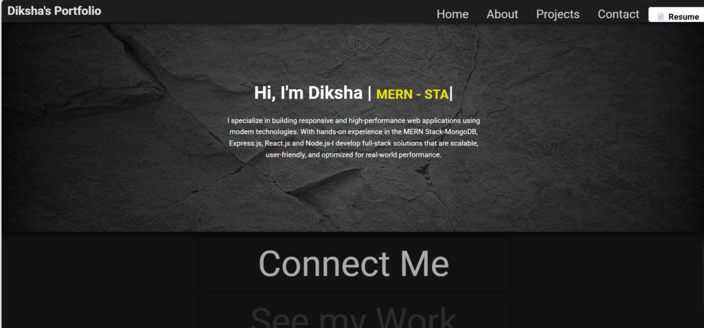

<!-- ----------------------------------------------------------------
 📌  Portfolio – Personal Developer Website
------------------------------------------------------------------- -->

# 💫 Personal Portfolio

A **clean, responsive, and blazing‑fast** developer portfolio built with **React, Vite, and Tailwind CSS**.  
Showcase your projects, tech stack, achievements, and contact information on a single, elegant page.

  

---

## 🚀 Key Features

| ✨ | Feature | Details |
|----|---------|---------|
| ⚡ | **Instant Loading** | Vite + React = near‑zero build overhead & snappy navigation. |
| 📱 | **Fully Responsive** | Looks great on mobiles, tablets, and desktops. |
| 🎨 | **Tailwind CSS Styling** | Utility‑first classes for rapid design tweaks. |
| 🛠 | **Easy Customisation** | Edit `src/data/` JSON files to update content without touching layout code. |
| 🔗 | **Smooth Scrolling & Section Links** | Navigate with keyboard or sidebar commands. |
| 🌙 | **Dark / Light Theme Toggle** | Built‑in colour‑scheme switcher (system preference aware). |
| 📦 | **One‑command Deploy** | Generate static build and deploy to GitHub Pages, Netlify, Vercel, etc. |

---

## 🏗️ Tech Stack

- **React 18**
- **Vite 5** (dev server & build)
- **Tailwind CSS 3**
- **Heroicons & Lucide‑React** (icons)
- **React‑Router DOM** (smooth page sections)
- **Framer‑Motion** (subtle animations)

---

